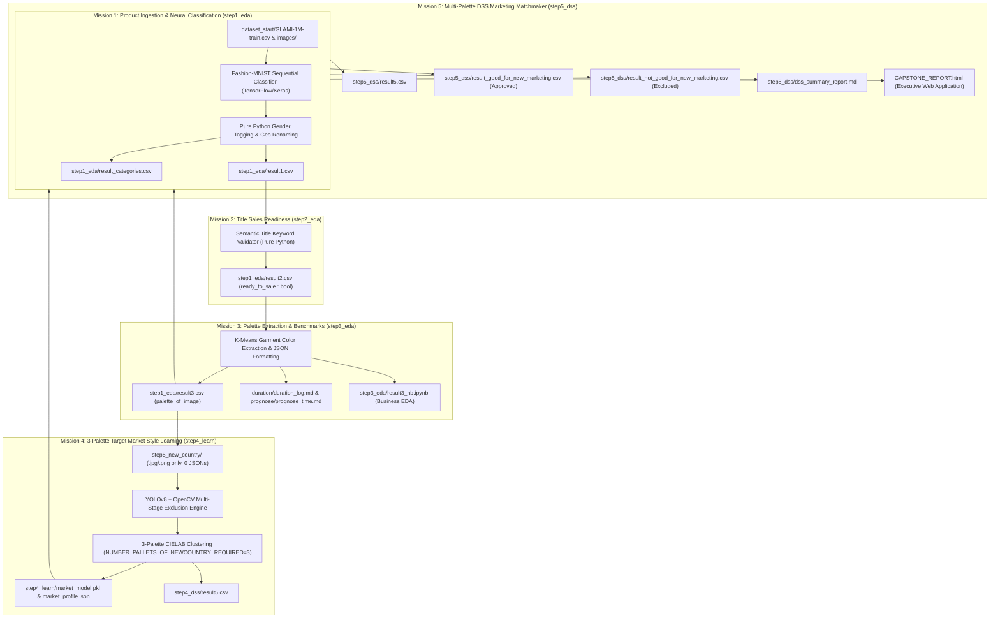

# System Architecture & Logic Guide: How It Works

This document provides a comprehensive end-to-end explanation of the **E-Commerce Product Catalog Expertise & Decision Support System (DSS)**. It outlines every mission and step in the structured format: **`Input -> Operation Sense -> Output`**.

---

## ⚙️ Global Configuration: `run_settings.json`

The system behavior, dataset size, and target market are controlled by `run_settings.json` located at the project root:
```json
{
  "DEFAULT_USE_FIRST_ITEMS": 200,
  "NUMBER_PALLETS_OF_NEWCOUNTRY_REQUIRED": 3,
  "description": "Global configuration settings for product catalog calculations, 3 country reference palettes, and DSS benchmarking",
  "target_market_country": "United States",
  "target_market_iso": "USA",
  "target_country_dir": "step5_new_country"
}
```
- **`DEFAULT_USE_FIRST_ITEMS`**: Controls how many items from `dataset_start/GLAMI-1M-train.csv` are ingested and processed through all downstream calculations (default: 200 items).
- **`NUMBER_PALLETS_OF_NEWCOUNTRY_REQUIRED`**: Defines how many structured fashion reference palettes the system extracts and benchmarks per demographic segment in the target country (default: **3 distinct palettes**).
- **`target_market_country`**: Display name for the target market (e.g. `United States` or `United Kingdom`).
- **`target_market_iso`**: ISO Alpha-3 code for target market (e.g. `USA` or `GBR`).
- **`target_country_dir`**: Reference photo library directory (`step5_new_country`).

---

## 🗺️ High-Level System Architecture



---

## 🇺🇸 Photo Library: `step5_new_country/` (100 American Casual Dressed Photos)

The `step5_new_country/` directory contains 100 high-quality, verified photos of American people and celebrities dressed in authentic casual clothing (strictly `.jpg` and `.png` image files, 0 `.json` files):
- **`step5_new_country/images/man/` (50 photos)**: American male celebrities and casual streetwear (Brad Pitt, Ryan Gosling, Chris Evans, Leonardo DiCaprio, Keanu Reeves, Michael B. Jordan, Pedro Pascal, Timothée Chalamet, George Clooney, Dwayne Johnson, Harrison Ford, Christian Bale, Ethan Hawke, etc.).
- **`step5_new_country/images/woman/` (50 photos)**: American female celebrities and casual streetwear (Jennifer Aniston, Taylor Swift, Zendaya, Emma Stone, Scarlett Johansson, Anne Hathaway, Blake Lively, Jennifer Lawrence, Selena Gomez, Margot Robbie, Hailey Bieber, Dakota Johnson, Reese Witherspoon, etc.).
- **Deduplication Status**: 100% unique across all 100 photos verified via 64-bit Difference Hashing (`dHash`).

---

## 🎨 3 Target Country Reference Palettes (`NUMBER_PALLETS_OF_NEWCOUNTRY_REQUIRED = 3`)

To avoid oversimplifying market taste into a single flat color list, the system partitions clean image-derived garment colors into **3 distinct, structured fashion palettes**:

1. **Palette 1: Core & Classic Neutrals**: Foundational everyday tones with balanced luminance and low saturation (e.g. Navy, Charcoal, Black, Slate, Crisp White, Beige).
2. **Palette 2: Contemporary & Earthy Streetwear**: Modern seasonal tones (e.g. Olive, Warm Terracotta, Camel, Sage, Washed Denim, Heather Gray).
3. **Palette 3: Vibrant Statement & Accents**: High chromatic saturation and expressive highlight tones (e.g. Amber/Gold, Pastel Pink, Burgundy, Cobalt Blue, Coral, Emerald).

---

## 🛠️ Step-by-Step System Logic

### Mission 1: Product Ingestion, Neural Classification & Visual Cleaning (`step1_eda/`)

#### 1. Input
- **Dataset File**: `dataset_start/GLAMI-1M-train.csv` (e-commerce catalog rows containing `item_id`, `image_id`, `geo`, `name`, `description`, `category`, `category_name`, `label_source`).
- **Product Images**: `dataset_start/images/{image_id}.jpg`.

#### 2. Operation Sense (Why & How)
- **Geo Normalization**: The original `geo` column is renamed to `produced_for_country` for clear data lineage.
- **Categories Aggregation**: All unique categories across the catalog are extracted and deduplicated to map catalog taxonomy.
- **Neural Garment Classification**:
  - A TensorFlow / Keras Sequential neural network (`Flatten(28, 28) -> Dense(128, 'relu') -> Dense(10, 'softmax')`) is trained on 10 Fashion-MNIST clothing classes: `['T-shirt/top', 'Trouser', 'Pullover', 'Dress', 'Coat', 'Sandal', 'Shirt', 'Sneaker', 'Bag', 'Ankle boot']`.
  - Custom product photos are loaded via OpenCV in grayscale (`cv2.IMREAD_GRAYSCALE`), resized to `(28, 28)`, inverted when the background is light (to match Fashion-MNIST's bright garment on dark background convention), and normalized to `[0.0, 1.0]`.
  - The model predicts `product_class_name` and `classification_confidence`.
  - **Fallback**: If an image is missing, corrupt, or contains no detectable clothing, it safely returns `product_class_name: 'noclothes'`.
- **Pure Python Gender Classification**:
  - Evaluates `category`, `category_name`, and product `name` keywords (e.g. `mens-`, `womens-`, `girls-`, `boys-`, `dámské`, `pánské`) using deterministic Python string matching without heavy ML dependencies.
  - Assigns `for_man`, `for_woman`, and `for_unisex` booleans.
- **Garment Color Extraction**: Isolates foreground fabric pixels and extracts primary color name, saturation, and brightness.

#### 3. Output
- **`step1_eda/result1.csv`**: Master dataset containing classified clothing types, gender tags, and color attributes.
- **`step1_eda/result_categories.csv`**: List of all unique catalog categories and their occurrence counts.

---

### Mission 2: Title Sales Readiness & Quality Control (`step2_eda/`)

#### 1. Input
- **Dataset File**: `step1_eda/result1.csv`.

#### 2. Operation Sense (Why & How)
- Evaluates whether product titles are search-optimized for e-commerce marketplaces (Google Shopping, Meta Ads, Amazon).
- Checks if the product title contains the recognized `product_class_name` keyword or an approved alias.
- Tags `ready_to_sale : bool` (`True` if descriptive keyword present, `False` if cryptic code).
- Generates `ready_to_sale_reason` and `suggested_optimized_name`.

#### 3. Output
- **`step1_eda/result2.csv`**: Catalog with `ready_to_sale`, reasons, and optimized names.

---

### Mission 3: K-Means Color DNA Extraction & Performance Benchmarks (`step3_eda/`)

#### 1. Input
- **Dataset File**: `step1_eda/result2.csv`.
- **Product Images**: `dataset_start/images/{image_id}.jpg`.

#### 2. Operation Sense (Why & How)
- Masks out white/light background borders using Otsu/adaptive thresholding.
- Applies K-Means clustering ($K=3$) to extract the top 3 dominant hex colors formatted as valid JSON array: `'["#1a202c", "#4a5568", "#cbd5e1"]'`.
- Determines `dominant_color`, `is_colored` boolean (chromatic saturation $> 0.18$), and human-readable color label.
- Benchmarks wall-clock execution times across all pipeline steps and computes sequential vs. 8-core parallel scaling prognoses for 10,000 and 1,000,000 items.

#### 3. Output
- **`step1_eda/result3.csv`**: Master catalog enriched with JSON `palette_of_image` and color metadata.
- **`duration/duration_log.md`**: Step-by-step measured durations.
- **`prognose/prognose_time.md` & `prognose/prognose_summary.json`**: Scaling models for 10k and 1M items.

---

### Mission 4: Target Market Style Learning (`step4_learn/`)

#### 1. Input
- **Catalog Dataset**: `step1_eda/result3.csv`.
- **Reference Photo Directory**: `step5_new_country/` (strictly `.jpg`/`.png` photos, 0 `.json` files).

#### 2. Operation Sense (Why & How)
- **YOLOv8 + OpenCV Multi-Stage Exclusion Engine**:
  - Automatically isolates human subjects and masks out extraneous items (cars, animals, bags, shoes, street furniture, studio backdrops).
  - OpenCV masks out human faces, exposed skin tones, and background halos.
- **3-Palette Extraction (`NUMBER_PALLETS_OF_NEWCOUNTRY_REQUIRED = 3`)**:
  - Samples clean garment pixels across Men and Women photos.
  - Groups 12 cluster centroids into 3 distinct 4-color palettes:
    - `palette_1`: Core & Classic Neutrals
    - `palette_2`: Contemporary & Earthy Streetwear
    - `palette_3`: Vibrant Statement & Accents
- **CIELAB Multi-Palette Nearest Neighbor Modeling**:
  - Fits demographic models in perceptual CIELAB space ($\Delta E$).
  - Evaluates candidate products against all 3 palettes, identifying the closest matching theme (`matched_country_palette_id`, `matched_country_palette_name`).

#### 3. Output
- **`step4_learn/market_model.pkl`**: Serialized multi-palette ML model.
- **`step4_learn/market_profile.json`**: Structured reference color profiles across all 3 palettes.
- **`step4_dss/result5.csv`**: Candidate products evaluated against the target market.

---

### Mission 5: Decision Support System (DSS) Marketing Recommendation (`step5_dss/`)

#### 1. Input
- **Candidate Catalog**: `step1_eda/result3.csv`.
- **Trained Model**: `step4_learn/market_model.pkl`.

#### 2. Operation Sense (Why & How)
- The DSS matchmaker compares each candidate product's palette against the 3 reference target palettes.
- Calculates composite perceptual distance ($\Delta E$) and normalized compatibility score ($0.0 - 1.0$).
- Tags `product_is_good_for_new_marketing : bool` (`True` if $\Delta E \le 13.5$ and score $\ge 0.60$).
- Assigns actionable marketing priority tiers:
  - **Tier 1: Prime Marketing Candidate** (Hero ad campaigns & paid acquisition)
  - **Tier 2: Standard Marketing Candidate** (Regular catalog syndication)
  - **Tier 3: Non-Priority / Neutral** (Organic listing only)
- Splits catalog into dedicated decision subsets and compiles strategic executive summary.
- Generates rich interactive HTML dashboard (`CAPSTONE_REPORT.html`) using Tamagui UI design principles.

#### 3. Output
- **`step5_dss/result5.csv`**: Master DSS output with multi-palette match metrics.
- **`step5_dss/result_good_for_new_marketing.csv`**: Filtered subset of approved marketing SKUs.
- **`step5_dss/result_not_good_for_new_marketing.csv`**: Filtered subset of excluded/outlier SKUs.
- **`step5_dss/dss_summary_report.md`**: Strategic DSS summary report.
- **`CAPSTONE_REPORT.html`**: Executive single-plane web application with Tamagui theme tokens, 3-palette visualizers, scaling prognoses, and interactive catalog explorer.
- **`HOW_IT_WORKS.html`**: Interactive web architecture & logic guide formatted in the same Tamagui design system.

---

## 🚀 Execution Scripts

### Full Pipeline Run (All 5 Missions + Reports)
- **macOS / Linux**:
  ```bash
  ./run_all_mac
  ```
- **Windows**:
  ```cmd
  run_all_win.bat
  ```

### View Web Applications (CAPSTONE_REPORT.html & HOW_IT_WORKS.html)
- **macOS / Linux**:
  ```bash
  # View Executive Capstone Report:
  ./open_report_mac
  
  # View Interactive How It Works Guide:
  ./open_report_mac HOW_IT_WORKS.html
  ```
- **Windows**:
  ```cmd
  REM View Executive Capstone Report:
  open_report_win.bat
  
  REM View Interactive How It Works Guide:
  open_report_win.bat HOW_IT_WORKS.html
  ```

### Dynamic Target Country Run
- **macOS / Linux**:
  ```bash
  ./run_dss_for_country_mac step5_new_country "United States" USA
  ```
- **Windows**:
  ```cmd
  run_dss_for_country_win.bat step5_new_country "United States" USA
  ```

### Save Codebase to GitHub (Automated Branch `ok_YY-MM-DD-HH-MM`)
- **macOS / Linux**:
  ```bash
  ./run_save_to_github_mac
  # or: ./run_save_to_github
  ```
- **Windows**:
  ```cmd
  run_save_to_github_win.bat
  REM or: run_save_to_github_win
  ```
- **Remote**: `https://github.com/fotomain/cv26repo.git`
- **Excludes**: `dataset_start/` (raw dataset files)
- **Branch Format**: `ok_YY-MM-DD-HH-MM` (e.g. `ok_26-08-16-19-19`)
